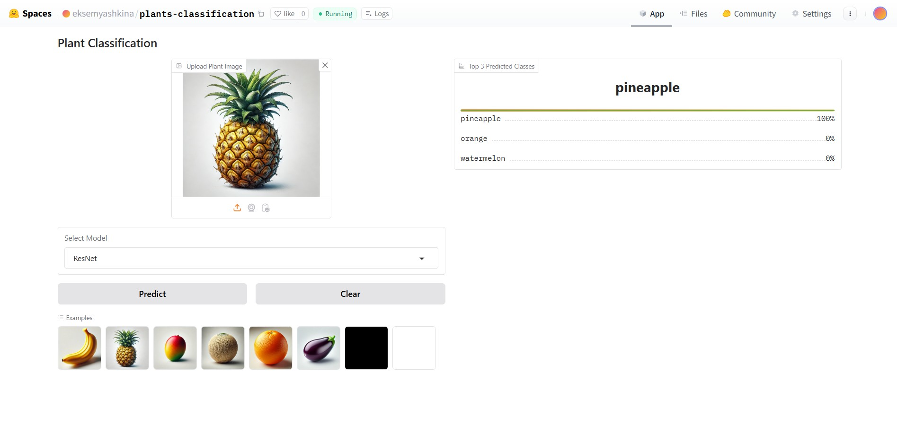
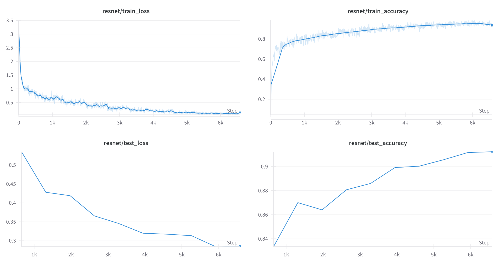
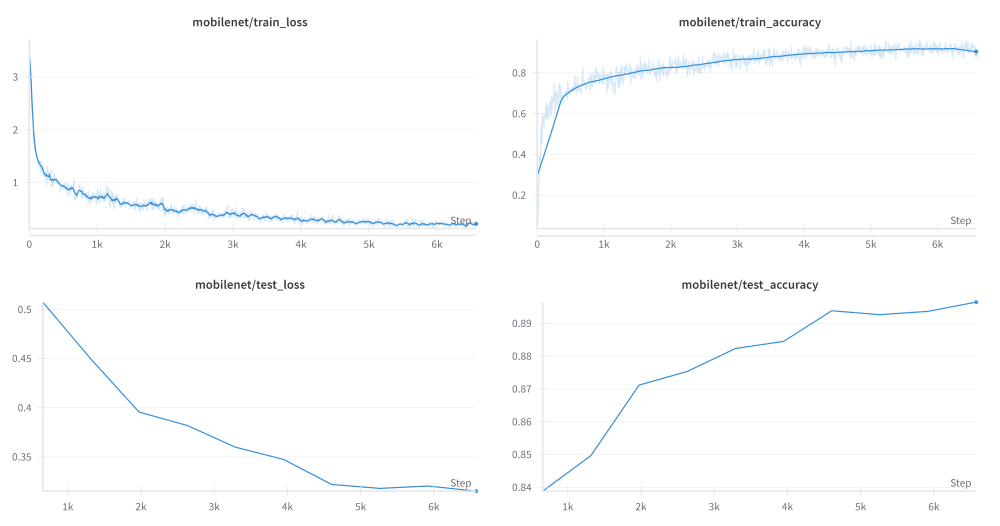

# Plant Classification


This project provides a solution for classifying plants into 30 classes using ResNet and MobileNetV2 models.

* ResNet
  * https://arxiv.org/abs/1512.03385
  * https://github.com/pytorch/vision/blob/main/torchvision/models/resnet.py
* MobileNetV2
  * https://arxiv.org/abs/1801.04381
  * https://github.com/pytorch/vision/blob/main/torchvision/models/mobilenetv2.py

The models were fine-tuned based on the torchvision implementation and pretrained weights. Gradio is used for building a web interface, and Weights & Biases for experiments tracking.

## Installation

1. Clone the repository:
    ```bash
    git clone https://github.com/ваш-проект/plant-classifier.git
    cd plant-classifier
    ```

2. Create and activate a virtual environment:
    ```bash
    python -m venv venv
    source venv/bin/activate
    ```
3. Install dependencies:
    ```bash
    pip install -r requirements.txt
    ```

4. Download the dataset (for training):
   ```bash
   python data/get_data.py
   ```

5. Download pre-trained ImageNet model weights (for training):
   ```bash
   cd weights
   bash download_pretrained.sh
   ```

6. Download checkpoints:

   During training, the best weights of the model are saved based on validation performance.
   ```bash
   cd weights
   bash download_checkpoints.sh
   ```

## Usage

### Training the Model
   To train a model, specify either **mobilenet** or **resnet** using the `--model` argument.
   ```bash
   python src/train.py --model mobilenet
   python src/train.py --model resnet
   ```

   You can also adjust other parameters, such as the number of epochs, batch size, and learning rate, by adding additional arguments. For example:
   ```bash
   python src/train.py --model resnet --num-epochs 20 --batch-size 64 --learning-rate 0.001
   ```

### Launching the Gradio Interface
   ```bash
   python app.py
   ```
   Once the interface is running, you can select a model (ResNet or MobileNetV2), upload an image of a plant, and get the top three predicted classes and its probabilities.

   

   https://huggingface.co/spaces/eksemyashkina/plants-classification

## Results

| Model      | Train Loss | Train Accuracy | Test Loss | Test Accuracy |
|------------|------------|----------------|-----------|---------------|
| ResNet     | 0.13493    | 0.93058        | 0.28589   | 0.91233       |
| MobileNet  | 0.22018    | 0.90438        | 0.31522   | 0.8965        |


### Training Results of ResNet



### Training Results of MobileNet

